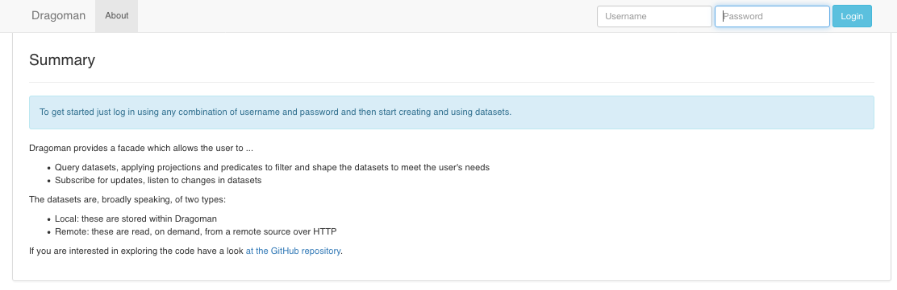
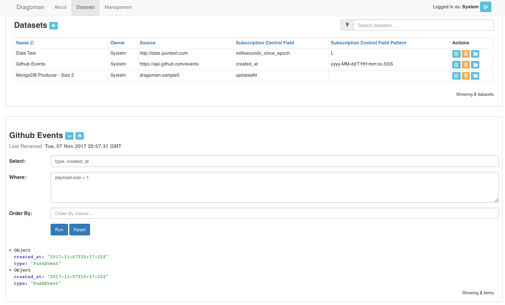
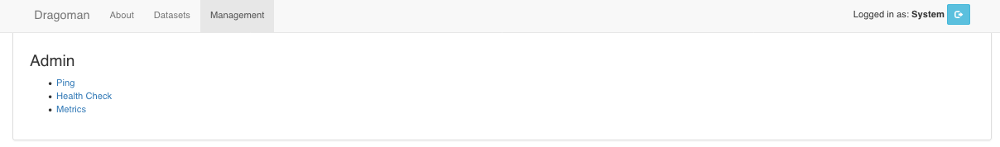

Introdution
======

#### Caveat

> Although this application is functional, its primary purpose is to provide a sandbox, a place for trying out technologies. Rather than attempting to do so in the context of something simplistic (another chat application or a calculator, perhaps) this application is intended to provide sufficient depth and breath to make any experimentation meaningful and useful. 

Dragoman provides a facade which allows the user to ...
        
* Query datasets, applying projections and predicates to filter and shape the datasets to meet the user's needs
* Subscribe for updates, listen to changes in datasets

The datasets are, broadly speaking, of two types:

* Local: these are stored within Dragoman
* Remote: these are read, on demand, from a remote source over HTTP 

#### Datatsets

A dataset is a datasource plus some metadata describing how Dragoman should use that datasource. It encapsulates the following state:

* Name: a user supplied name for the dataset e.g. something representative of the dataset's content/purpose.
* Owner: defaults to the name of the user logged in when the dataset was created
* Source: two types of dataset sources are supported:
  * HTTP: in which case this will be a URL
  * MongoDB: in which case this will be Mongo storage co-ordinates in the form `<database_name>:<collection_name>` 
* Subscription Control Field: the name of an attribute within the dataset which indicates when it was created. When subscribing, this is used to restrict the subscription event stream to only those events which have emerged since the previous subscription event was published.
* Subscription Control Field Pattern: by default the `Subscription Control Field` is assumed to be a datetime expressed in ISO8601 format. However, not all datasets conform to that convention so the user may define their own pattern, two types are supported:
  * DateTime: in which case the value will be expressed in Java's [datetime format](https://docs.oracle.com/javase/8/docs/api/java/time/format/DateTimeFormatter.html)
  * The numeric symbolic: `L`: this is used when the `Subscription Control Field` is a Java epoch value 

The user may perform the following actions on a Dataset:

* Create: by clicking on the `plus` icon in the header of the Datasets table.
* Edit: by clicking on the `edit` icon under the Actions column in the Datasets table. Note: all fields are editable except `Owner` since this defaults to the currently logged in user
* Delete: by clicking on the `trashcan` icon under the Actions column in the Datasets table.
* Sample: by clicking on the `open folder` icon under the Actions column in the Datasets table. This will load _any_ 10 records from the selected datasource.

Once a dataset has been opened, the user can perform the following actions:

* Query: by entering `Select` / `Where` / `Order By` and then hitting `Run`. See [Querying Datasets](querying.md) for more details on how to run a query. 
* Subscribe for updates to the dataset: by clicking on the `eye` icon next to the dataset name in the dataset contents view. See [Subscribing To Datasets](subscribing.md) for more details on how to subscribe to a dataset.
* Close: by clicking on the `minus` icon next to the dataset name in the dataset contents view.

#### Security

There's limited security; a user must log in to the web app before using it but there is no independent authorisation store. The purpose of 'logging in' is really only to identify yourself so that multiple users do not see each other's datasets. In addition, when running in `embedded` mode a default user - `System` - is assumed to be already logged in. 

#### Management

Dragoman exposes some simple management features ...

* A `ping` endpoint which returns a `200 pong` response when the appliction is up.
* A `healthcheck` endpoint which returns a `200` status if all system health checks are ok, otherwise it will return a `500` status.
* A `metrics` endpoint which allows the user to view and query the metrics exposed by the application. More details on this in the [metrics](metrics.md) topic.

#### Screenshots

##### Landing Page

This screenshot shows the landing page, since no one has logged in at this stage only the `About` view is available:

Once someone logs in, the remaining views (`Datasets` and `Management`) become available ...

##### Datasets

This screenshot shows the dataset list with one dataset opened and queried:
 
 

##### Management

This screenshot shows the management view, exposing endpoints which provide some _behind the scenes_ visibility 
 

#### Further Reading

Follow the links in the side bar to read more about ...

* How the application works
* What technologies are in user
* How to manage the system at runtime: metrics, logging, monitoring etc

