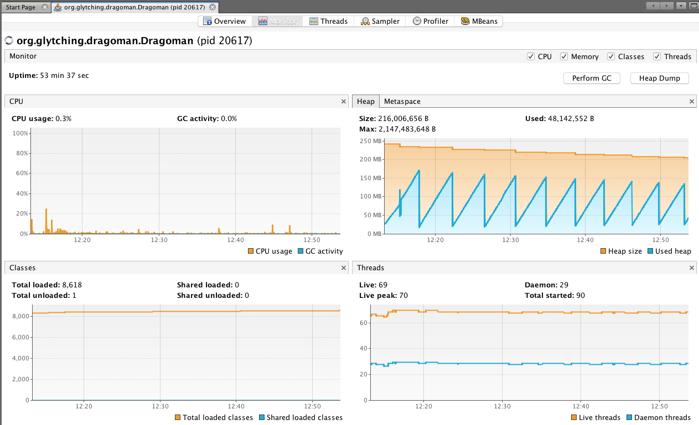

Monitoring Dragoman
======

Dragoman uses [Vert.x DropWizard Metrics](http://vertx.io/docs/vertx-dropwizard-metrics/java/) to gather and emit metrics. 

These metrics include size and throughput values for:

* Thread pools
* EventBus
* HTTP server traffic

The metrics output is available in several flavours ...

#### Logs
 
The `MetricsFacade` wraps Vert.x's `MetricsService` and, using a Vert.x timer, it periodically writes the latest metrics snapshot to the logger: `metrics-logger`. The periodicity is controller by the application property: `metrics.publication.period.in.millis`. 

Although the metrics output is written in JSON, it is quite verbose so not easily readable (human readable, at least). It is expected that anyone wishing to make use of the logged metrics output will write to file and will use a tool ([Graylog](https://www.graylog.org/) perhaps) to ingest that file and provide visualisations of it. To facilitate this approach: 

* The `metrics-logger` is always written to file when the `-Dlog.dir` property is supplied at runtime 
* Each metrics log is written in JSON (for ease of programmatic interrogation) and is accompanied by a timestamp (to help with visualisations-over-time)
  

#### HTTP endpoint

The `metrics` endpoint exposes a JSON representation of the lastest metrics snapshot. By default, this emits the entire snapshot but the response can be qualified by:

* Passing a chosen metric name as a path parameter. For example:
  * `metrics/get-requests` will only return the `get-requests` metric
* Passing a regular expression as a query parameter, the regex will be applied to metric names and only those metrics whose name matches the regex will be returned. For example:   
  * `/metrics?regex=responses.*` will return only those metrics having a name which starts with `responses`
    
#### JMX

Each metric is exposed via a JMX MBean, all of these MBeans are available in a MBean domain named: `dragoman`. Here's a screenshot showing some of these MBeans viewed in JVisualVM:

JVisualVM (and JConsole) provide some rudimentary visualisation of numeric metrics. If you double click on a numeric value in the attributes tab then a graph will appear, this will be updated as the underlying value changes. For example:

In addition, JVisualVM provides a useful Monitor view showing CPU, heap and thread usage. For example:

This

That

The other

And more of the other
[]