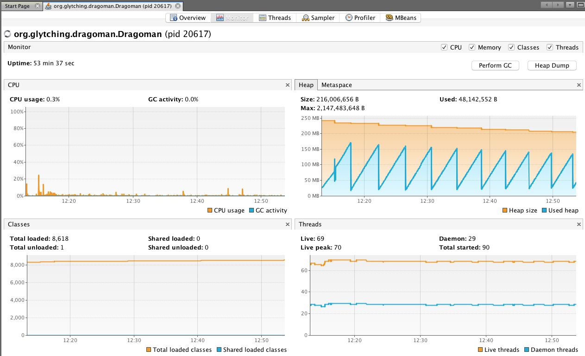

Monitoring Dragoman
======

#### Health Checks

Dragoman uses [Dropwizard's Health Checks](https://dropwizard.github.io/metrics/3.1.0/manual/healthchecks/. The configured healthchecks are available at the `/healthcheck` HTTP endpoint. Here's an example of the output:

```json
{

    "IsMongoConnected": {
        "healthy": true,
        "message": "Connected to MongoDB at localhost:27017",
        "error": null
    }

}
```

If all of the configured health checks are _healthy_ this endpoint will return a `200` status, otherwise it will return a `500` status.

#### Using JVisualVM

Dragoman is JMX aware, so you can connect to it using [JVisualVM](https://visualvm.github.io/). This tool provides a useful Monitor view showing CPU, heap and thread usage. For example:



#### Using Jolokia and Hawtio

[Jolokia](https://jolokia.org/) is a JMX-HTTP bridge giving an alternative to JSR-160 JMX clients. [Hawtio](http://hawt.io/) is a modular web console which can consume data exposed by Jolokia. 

Dragoman embeds a Jolokia agent running on the port defined by the `jolokia.port` property in `application.properties`. If the `jolokia.enabled` property is `true' (this is its default value) then this agent will be started when Dragoman is started.  

You can confirm that this agent is running by:

* Looking for this log message: `Starting Jolokia agent on port: ...`

* Browsing to this address: `http://<host>:31010/jolokia/` where 'host' is the name of the host on which Dragoman is running. If the agent is running you'll get a `200` response with a JSON payload containing the agent configuration.

##### Running Hawtio 

1. Download Hawtio from [here](https://oss.sonatype.org/content/repositories/public/io/hawt/hawtio-app/1.5.5/hawtio-app-1.5.5.jar) and run this from a command line:

```
java -jar hawtio-app-1.5.5.jar
```

More details on the [Hawtio site](http://hawt.io/getstarted/index.html).

This will launch a browser instance pointing at the Hawtio dashboard. To connect this to the Jolokia agent running inside Dragoman enter connection details like so ...


.. and hit `Connect to remote server`.

This will launch the Hawtio console for Dragoman, here's a screenshot:


